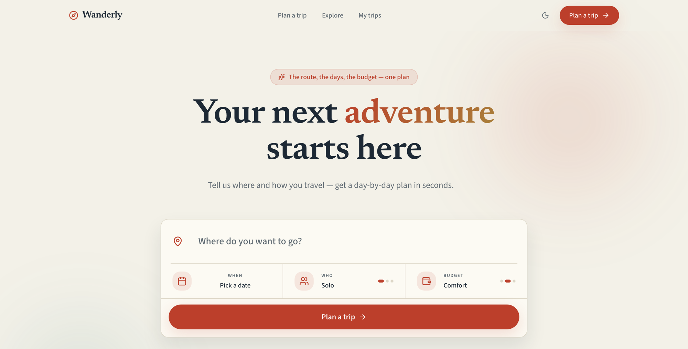

# Wanderly

**Tell it where you want to go and how you like to travel. Get the whole trip back.**

Not a list of flights, not a blank itinerary template — a finished plan: the route between cities, a day-by-day schedule with real opening-hours-shaped days, the trains and flights that connect them, what it costs per person, and what it costs the atmosphere.



## What it's for

Planning a multi-city trip usually means a dozen tabs and a spreadsheet that goes stale the moment you change your mind. Drop a city and you have to renumber the days, re-cost the trains, redo the budget, and re-check whether the museum you moved is even open that afternoon.

Wanderly does the whole pass at once and keeps the pieces consistent afterwards. Remove a stop and the route re-optimizes, the days renumber, the transport re-costs and the budget recomputes — because the plan is generated, not typed.

Three things shape everything else:

- **It runs entirely in your browser.** No backend, no account, no API keys. The city data ships with the app, so it works on a plane.
- **The engine is deterministic.** The same answers always produce the identical plan, which is why a share link needs no server: the URL carries the intent, and your friend's browser regenerates the exact same trip.
- **Home is a place, not a stop.** The trip starts and ends at your front door, so getting there and back is routed, timed and costed like every other leg.

> Wanderly is a personal project built to explore what a travel planner looks like when the whole trip is one artifact. The city dataset is curated and finite (41 cities across 20 countries in Europe), and prices are modelled, not live.

## Running it

You need [Node.js](https://nodejs.org) 20.9 or newer.

```bash
git clone https://github.com/youssefassis/travel-planner.git
cd travel-planner
npm install
npm run dev
```

Then open **http://localhost:3000**.

To run the production build instead — which is also the only mode where the offline service worker registers:

```bash
npm run build
npm start          # http://localhost:3000
```

| Script | What it does |
| --- | --- |
| `npm run dev` | Dev server with hot reload |
| `npm run build` | Production build |
| `npm start` | Serve the production build |
| `npm run lint` | ESLint — the baseline is zero errors and zero warnings |
| `npm t` | Vitest; tests sit next to the code as `*.test.ts` |

## What you get

**Planning the trip**

- **Three questions, one full plan** (`/planner`) — optimized route, timed daily schedules that put meals in restaurants and nightlife after dinner, an activity load that matches your pace, a booking checklist, and an interactive map.
- **Editable afterwards** — swap a stop, drop a museum, add a sight you skipped, make a rainy day indoor-friendly, reorder a day, or add and remove whole cities. Route, day numbering and budget recompute on the spot.
- **Real dates, optional** — pin a start date and the itinerary picks up weekdays and calendar dates, flight legs search their actual departure day, and the trip exports to `.ics`. Leave it out and the plan works in Day 1..N.
- **Travel days that cost time** — the day you arrive starts when the train does, the day you fly home ends before the flight, and both hold fewer stops than a full day. Journeys appear on the timeline, in the print-out and in the calendar export.

**What it costs**

- **Budgets in one unit** — every figure is per person, with the whole party's total beside it.
- **Carbon footprint** — per traveller, per leg, and how far below flying the route keeps you. Where a flown pair has a train that genuinely runs, the itinerary says so.
- **Honest journey times** — high-speed corridors are timed as they actually run (Milan–Rome is 3 hours, not 5), and no route puts a train across the Irish Sea. Every duration is door to door, so rail and air compare fairly.

**Deciding where to go** (`/explore`)

- **Spin the globe** — a split-flap departure board flutters through destinations and settles on one, filtered by the vibe and region you want.
- **Match the weather** — chase warm, dry or sunny, with every city ranked by its real monthly climate normals.
- **What can I afford?** — name a budget and see every destination it reaches, best trip first. Each figure is a real generated plan, so the estimate is what you get when you click through.

**Living with it**

- **Saved trips** — the planner restores what you were last looking at after a refresh, and saved trips are listed before the wizard so you can pick one back up. Everything stays in your browser.
- **Today** — while the trip is running, the planner opens on the day you're actually on: what's happening now, what's next, what's done, and how to get there.
- **Works offline** — installable as a PWA. The engine, the city data and your saved trips all live in the browser, so the itinerary, budget and packing list work with no signal. Only the map needs a connection.
- **Compare alternatives** — other ways to take the same trip, each changing exactly one variable so the trade is legible: the budget tier, the pace, a stop that isn't earning its place, a flight in the middle of the route. Adopt one and it becomes your trip.
- **Share & export** — copy a link that regenerates the identical plan, add it to a calendar, open the route in Google Maps, share as text, or print to PDF.

## How it's built

Next.js 16 (App Router) · React 19 · TypeScript (strict) · Tailwind CSS v4 · Zustand · Framer Motion · MapLibre GL with keyless [OpenFreeMap](https://openfreemap.org) tiles · Vitest

```
src/
  app/         routes — home, /planner (the trip hub), /trips, /explore
  domain/      shared vocabulary: types, the city dataset, geo, corridors, carbon
  features/    planner (engine + wizard), flights, stays, weather, discover, marketing
  components/  UI primitives, layout, theming
```

Imports flow one way: `app → features → domain`, and features never import each other. The trip engine is a pure pipeline — `selectCities → orderRoute → allocateDays → transport → dayPlans → budget` — with no clock and no randomness inside it, which is what makes share links reproducible.

The layering rules, engine internals and design tokens are written up for contributors in [CLAUDE.md](CLAUDE.md).

## Credits

Destination photography comes from Wikimedia Commons under CC0 and CC BY-SA. Photographers, licences and source pages are listed in [`public/credits.txt`](public/credits.txt), which the site links from its footer.
